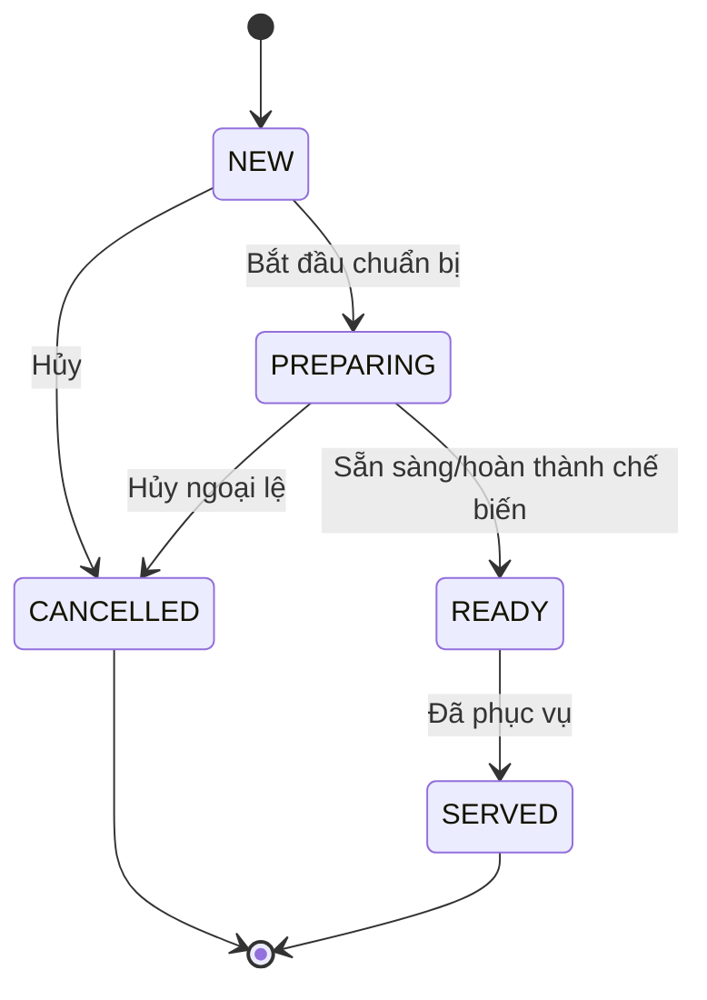
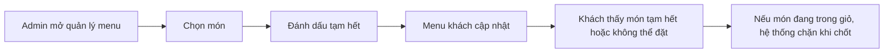

# Quy trình nghiệp vụ thống nhất

## 1. Mục tiêu tài liệu
Tài liệu này là single source of truth cho quy trình vận hành prototype. Khi có tranh luận giữa PO, BA, PM, Dev hoặc khách hàng, ưu tiên đối chiếu tài liệu này trước.

## 2. Thuật ngữ thống nhất
| Thuật ngữ | Định nghĩa |
|---|---|
| Bàn | Đơn vị vị trí vật lý tại quán, có mã QR riêng |
| QR bàn | Mã dẫn khách vào web app với token định danh bàn |
| Phiên bàn | Lượt phục vụ của một nhóm khách tại một bàn, bắt đầu khi khách ngồi/gọi món và kết thúc khi bàn được reset |
| Giỏ hàng | Danh sách món tạm trên thiết bị khách trước khi chốt |
| Order | Đơn chính thức được gửi vào hệ thống sau khi khách chốt giỏ |
| Order bổ sung | Order mới phát sinh cùng phiên bàn khi khách gọi thêm sau order đầu |
| KDS | Kitchen Display System, màn hình bếp/quầy nhận và xử lý order |
| Món tạm hết | Món vẫn có thể hiển thị nhưng không được thêm vào giỏ/chốt đơn |

## 3. Quy trình To-Be tổng quát

```mermaid
flowchart LR
    A[Khách ngồi vào bàn] --> B[Quét QR bàn]
    B --> C[Hệ thống nhận diện bàn và phiên]
    C --> D[Khách xem menu số]
    D --> E[Chọn món, option, ghi chú]
    E --> F[Kiểm tra giỏ và tổng tạm tính]
    F --> G[Chốt đơn]
    G --> H[Hệ thống tạo order]
    H --> I[KDS nhận order mới]
    I --> J[Bếp/quầy chuẩn bị]
    J --> K[Cập nhật trạng thái]
    K --> L[Khách theo dõi trạng thái]
    L --> M[Nhân viên phục vụ món]
    M --> N[Thu ngân/quản lý đóng phiên và reset bàn]
```

## 4. Vòng đời phiên bàn
| Trạng thái phiên | Ý nghĩa | Ai tạo/cập nhật | Ghi chú prototype |
|---|---|---|---|
| `AVAILABLE` | Bàn sẵn sàng cho lượt khách mới | Admin/thu ngân hoặc mặc định hệ thống | QR vẫn cố định |
| `OPEN` | Khách đã vào flow gọi món hoặc order đầu tiên đã phát sinh | Hệ thống tự mở khi khách chốt đơn đầu tiên | Có thể mở ngay khi quét QR nếu cần tracking |
| `ORDERING` | Khách đang xem menu/chọn món | Hệ thống | Trạng thái này có thể không cần lưu DB trong prototype |
| `SERVING` | Bàn có order đang xử lý/đã phục vụ một phần | Hệ thống/KDS | Dùng để admin biết bàn đang có khách |
| `CLOSED` | Phiên kết thúc, chờ reset hoặc đã reset | Thu ngân/quản lý ca | Sau reset, order lịch sử vẫn giữ theo session cũ |

## 5. Quy trình khách đặt món lần đầu
| Bước | Actor | Hành động | Rule bắt buộc | Kết quả |
|---:|---|---|---|---|
| 1 | Khách | Quét QR tại bàn | QR phải hợp lệ và map đúng bàn | Mở web app bàn tương ứng |
| 2 | Hệ thống | Tải menu đang bán | Chỉ hiển thị món `ACTIVE` và `SOLD_OUT` nếu admin cho phép | Khách thấy danh mục/món |
| 3 | Khách | Xem chi tiết món | Món `HIDDEN` không hiển thị | Hiểu giá, ảnh, mô tả, option |
| 4 | Khách | Thêm món vào giỏ | Chỉ món `ACTIVE` được thêm | Giỏ có món, option, ghi chú, số lượng |
| 5 | Khách | Xem giỏ và chốt đơn | Giỏ không rỗng; option bắt buộc đã chọn; ghi chú không quá giới hạn | Request tạo order được gửi |
| 6 | Hệ thống | Kiểm tra lại trạng thái món | Nếu món vừa hết thì chặn và yêu cầu sửa giỏ | Order hợp lệ được tạo |
| 7 | Hệ thống | Gửi order tới KDS | Cần chống trùng bằng idempotency key | Bếp thấy order mới |
| 8 | Khách | Xem màn hình theo dõi | Trạng thái khách là bản dịch thân thiện từ trạng thái nội bộ | Khách biết đơn đã tiếp nhận |

## 6. Quy trình bếp/quầy xử lý order

| Trạng thái nội bộ | Nhãn cho bếp/quầy | Nhãn cho khách | Ai đổi trạng thái |
|---|---|---|---|
| `NEW` | Mới nhận | Đơn đã được tiếp nhận | Hệ thống tạo |
| `PREPARING` | Đang chuẩn bị | Đang chuẩn bị | Bếp/quầy |
| `READY` | Sẵn sàng | Đang mang ra / Đã sẵn sàng | Bếp/quầy |
| `SERVED` | Đã phục vụ | Đã phục vụ | Phục vụ/bếp/quản lý |
| `CANCELLED` | Hủy | Đơn đã hủy | Quản lý/bếp theo quyền |

## 7. Quy trình gọi thêm món
| Bước | Actor | Hành động | Quy tắc |
|---:|---|---|---|
| 1 | Khách | Mở lại menu từ màn hình tracking hoặc quét lại QR | Vẫn vào cùng bàn; nếu phiên chưa reset thì vào phiên đang mở |
| 2 | Khách | Chọn món mới | Không sửa order cũ trong MVP |
| 3 | Khách | Chốt giỏ mới | Tạo order bổ sung |
| 4 | KDS | Nhận order bổ sung | Hiển thị cùng bàn, thời gian mới, mã order mới |
| 5 | Admin/thu ngân | Xem tổng các order trong phiên | Có thể đối soát theo table session |

## 8. Quy trình món tạm hết

| Rule | Nội dung |
|---|---|
| SOLD-01 | Món `SOLD_OUT` không được thêm mới vào giỏ |
| SOLD-02 | Nếu món đã nằm trong giỏ rồi mới bị tạm hết, hệ thống chặn tại bước chốt đơn |
| SOLD-03 | Admin có thể bật lại món về `ACTIVE` |
| SOLD-04 | Order lịch sử không bị thay đổi khi trạng thái món thay đổi |

## 9. Quy trình reset bàn
| Bước | Actor | Hành động | Lý do |
|---:|---|---|---|
| 1 | Khách | Dùng bữa và thanh toán ngoài hệ thống | Thanh toán online ngoài scope |
| 2 | Nhân viên | Dọn bàn | Xác nhận bàn đã sẵn sàng cho lượt mới |
| 3 | Thu ngân/quản lý | Bấm `Đóng phiên/Reset bàn` | Tránh khách mới thấy/order vào phiên cũ |
| 4 | Hệ thống | Đóng table session cũ và tạo trạng thái sẵn sàng | Lịch sử order vẫn giữ để đối soát |

## 10. Ma trận trách nhiệm RACI
| Quy trình | Khách | Phục vụ | Bếp/quầy | Thu ngân/quản lý | Admin/chủ quán | Hệ thống |
|---|---|---|---|---|---|---|
| Quét QR và xem menu | R | C | I | I | I | A |
| Thêm món/chốt đơn | R | C | I | I | I | A |
| Kiểm tra món còn bán | I | C | C | C | R | A |
| Nhận order | I | I | R | I | I | A |
| Cập nhật trạng thái order | I | C | R | A | I | C |
| Phục vụ món | I | R | C | I | I | I |
| Reset bàn | I | C | I | R | A | C |
| Quản lý menu | I | I | C | C | A/R | C |

Chú thích: R = Responsible, A = Accountable, C = Consulted, I = Informed.

## 11. Business rules đã chốt cho prototype
| ID | Rule |
|---|---|
| BR-01 | Mỗi QR chỉ đại diện cho một bàn tại một thời điểm. |
| BR-02 | QR cố định theo bàn; phiên bàn mới được quản lý bằng reset session. |
| BR-03 | Khách không cần đăng nhập để đặt món trong MVP. |
| BR-04 | Một bàn có thể có nhiều order trong cùng một phiên. |
| BR-05 | Sau khi chốt, order không được sửa trong flow chính của MVP. |
| BR-06 | Gọi thêm tạo order bổ sung. |
| BR-07 | Chỉ món `ACTIVE` được đặt. |
| BR-08 | Order lưu snapshot tên món, giá, option và ghi chú tại thời điểm chốt. |
| BR-09 | Hệ thống phải chống trùng order khi khách bấm nhiều lần. |
| BR-10 | Bếp/quầy là actor chính cập nhật trạng thái xử lý order. |
| BR-11 | Trạng thái hiển thị cho khách phải thân thiện hơn trạng thái nội bộ. |
| BR-12 | Reset bàn là thao tác vận hành bắt buộc để tránh lẫn phiên khách. |

## 12. Ngoại lệ và cách xử lý
| Ngoại lệ | Cách xử lý trong prototype |
|---|---|
| QR không hợp lệ | Hiển thị màn hình lỗi và hướng dẫn gọi nhân viên |
| Mất mạng khi chốt đơn | Hiển thị trạng thái đang gửi, cho phép thử lại an toàn bằng idempotency key |
| Món vừa bị tạm hết | Chặn submit, nêu món bị ảnh hưởng, yêu cầu khách xóa/chọn món khác |
| Bếp cập nhật sai trạng thái | Cho phép quản lý đổi lại trong phạm vi logic hoặc ghi chú xử lý thủ công |
| Khách quét nhầm QR bàn khác | Hiển thị rõ số bàn trên mọi màn hình, khách/nhân viên phát hiện sớm |
| Nhiều thiết bị cùng bàn | Mỗi thiết bị có giỏ riêng, order sau khi chốt cùng gắn vào phiên bàn |
| Bàn chưa reset nhưng khách mới quét | Cảnh báo trên admin; quy trình vận hành yêu cầu reset sau dọn bàn |

## 13. Checklist vận hành ngày demo
| Thời điểm | Checklist |
|---|---|
| Trước demo | Tạo ít nhất 5 bàn, mỗi bàn có QR/token; nhập 15-20 món; có 2 món tạm hết; chuẩn bị tablet/laptop KDS |
| Trong demo | Dùng bàn 05 làm flow chính; gửi order có ghi chú; đổi trạng thái trên KDS; gọi thêm món; tạm hết một món |
| Sau demo | Thu feedback theo 3 nhóm: flow khách, flow bếp, flow admin |

## 14. Điểm cần khách hàng ký xác nhận
| ID | Nội dung xác nhận |
|---|---|
| SIGN-01 | Prototype không xử lý thanh toán online. |
| SIGN-02 | Prototype không đồng bộ POS thật. |
| SIGN-03 | Order sau khi chốt không sửa trực tiếp; gọi thêm tạo order mới. |
| SIGN-04 | Bàn cần reset phiên sau khi khách rời bàn. |
| SIGN-05 | AI không nằm trong critical path của prototype, trừ khi demo mock theo kịch bản. |
