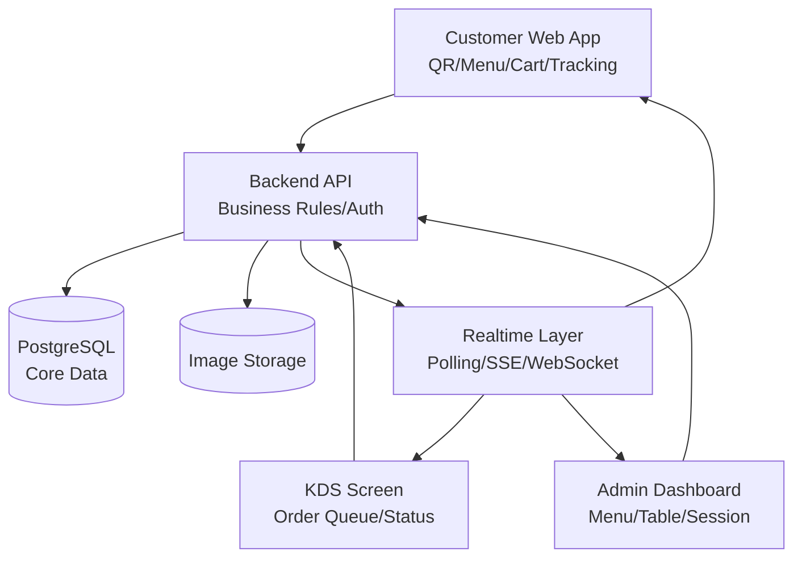
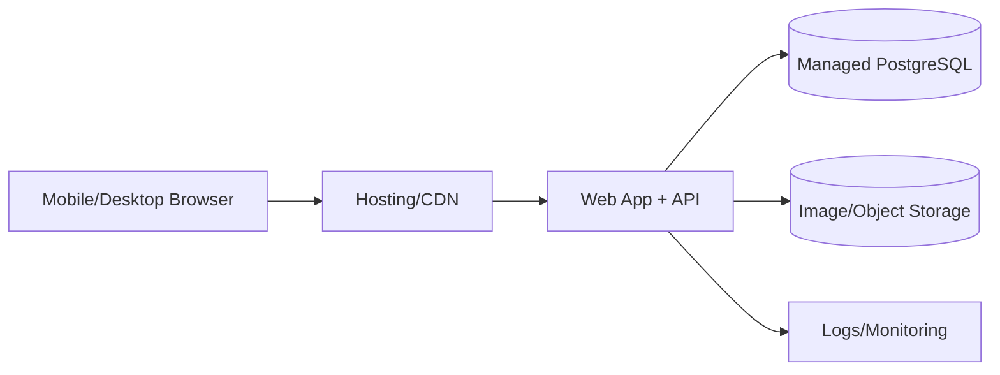

# Kiến trúc kỹ thuật đề xuất cho CTO/Tech Lead

## 1. Mục tiêu kiến trúc
Kiến trúc prototype cần ưu tiên tốc độ triển khai, khả năng demo end-to-end, dữ liệu nhất quán và đường mở rộng rõ ràng sang production. Không nên over-engineer các phần POS, payment, multi-branch hoặc AI agent khi core ordering chưa ổn định.

## 2. Nguyên tắc kỹ thuật
| Nguyên tắc | Diễn giải |
|---|---|
| Web-first | Khách không cần cài app, chỉ cần QR link |
| Mobile-first | Customer UI tối ưu điện thoại, KDS/Admin tối ưu tablet/desktop |
| API-first vừa đủ | Frontend/KDS/Admin dùng chung backend API |
| Snapshot dữ liệu order | Order lưu tên/giá/option tại thời điểm chốt |
| Idempotent submit | Chống tạo order trùng do retry/bấm nhiều lần |
| Realtime pragmatism | Prototype có thể dùng polling/SSE/WebSocket tùy team; không để realtime làm chậm delivery |
| Auth rõ ràng | Link khách không được có quyền admin/KDS |

## 3. Kiến trúc logical

## 4. Stack khuyến nghị cho prototype
| Layer | Khuyến nghị nhanh | Phương án production-friendly |
|---|---|---|
| Frontend | Next.js/React hoặc React SPA | Next.js + component system |
| Backend | Next.js API routes hoặc Node/NestJS | NestJS/Fastify service riêng |
| Database | PostgreSQL | PostgreSQL managed, migration bằng Prisma/Drizzle |
| ORM | Prisma hoặc Drizzle | Prisma/Drizzle với migration kiểm soát |
| Realtime | Polling 3-5 giây hoặc SSE | WebSocket/SSE + Redis pub/sub nếu tải cao |
| Auth nội bộ | Email/password đơn giản hoặc provider sẵn có | RBAC rõ: admin, manager, kitchen |
| Image | Local/static seed hoặc object storage | S3-compatible storage/CDN |
| Deploy | Vercel/Render/Fly/Supabase tùy stack | CI/CD, staging, production |

Khuyến nghị thực dụng: nếu team cần prototype nhanh, dùng một monorepo Next.js full-stack với PostgreSQL và Prisma/Drizzle. Nếu team backend mạnh và muốn đi gần production hơn, tách frontend Next.js và backend NestJS.

## 5. Module kỹ thuật
| Module | Trách nhiệm |
|---|---|
| QR resolver | Nhận `qr_token`, trả thông tin bàn/quán/session context |
| Menu service | Trả danh mục, món, trạng thái, option |
| Cart client | Lưu giỏ local, validate cơ bản trước submit |
| Order service | Validate server-side, tạo order, snapshot giá, idempotency |
| KDS service | Query order queue, update status, ghi status history |
| Admin service | CRUD menu/category/table, đổi trạng thái món, reset table session |
| Realtime service | Notify order created/status changed/menu status changed |
| Auth/RBAC | Bảo vệ Admin/KDS API |

## 6. Quyết định dữ liệu quan trọng
| Quyết định | Khuyến nghị |
|---|---|
| Multi-tenant | Prototype có `store_id`, `branch_id` nhưng có thể seed 1 store/1 branch |
| Table session | Có entity riêng để reset bàn và gom order bổ sung |
| Order code | Sinh short code dễ đọc theo bàn/ngày, không dùng UUID làm mã hiển thị |
| Price snapshot | Bắt buộc trong `order_items` |
| Menu item status | Enum `ACTIVE`, `SOLD_OUT`, `HIDDEN` |
| Order status | Enum `NEW`, `PREPARING`, `READY`, `SERVED`, `CANCELLED` |
| Notes | Giới hạn length, sanitize output |

## 7. API và realtime strategy
| Nhu cầu | Prototype | Khi scale |
|---|---|---|
| KDS nhận order mới | Poll `/orders?status=active` mỗi 3-5 giây hoặc SSE | WebSocket/SSE + event bus |
| Khách theo dõi trạng thái | Poll order detail mỗi 3-5 giây | SSE/WebSocket theo order/session |
| Menu status update | Refetch menu khi mở app hoặc polling nhẹ | Cache invalidation/event |
| Admin/KDS sync | Manual refresh + polling | WebSocket + optimistic UI |

## 8. Bảo mật tối thiểu
| Khu vực | Kiểm soát |
|---|---|
| QR customer | Token khó đoán, chỉ cho quyền xem menu/tạo order cho bàn tương ứng |
| Admin/KDS | Bắt buộc auth; route và API protected |
| Order submit | Validate server-side, rate limit nhẹ theo token/IP nếu có |
| Input | Sanitize ghi chú, giới hạn length, không render HTML thô |
| ID exposure | Không lộ ID nội bộ nhạy cảm nếu không cần; dùng order code cho UI |
| CSRF/CORS | Cấu hình theo mô hình deploy; không mở admin API public không kiểm soát |
| Audit | Ghi lại status changes và reset session nếu có user nội bộ |

## 9. Non-functional targets cho prototype
| Nhóm | Target đề xuất |
|---|---|
| Menu load | Dưới 2 giây với dữ liệu demo trên mạng ổn định |
| Submit order | Phản hồi dưới 2 giây trong demo local/staging |
| KDS refresh | Order mới xuất hiện trong 5 giây nếu dùng polling |
| Mobile | Hoạt động tốt trên màn 360px trở lên |
| Availability | Đủ ổn định cho demo/UAT, có seed/reset data nhanh |
| Observability | Log order submit, status update, API errors |

## 10. Deployment topology đề xuất

## 11. Testing strategy
| Loại test | Nội dung |
|---|---|
| Unit | Business rule: status transition, price snapshot, idempotency |
| Integration | Submit order tạo order + items + status history |
| API | QR resolve, menu list, order submit, status update |
| UI smoke | Customer flow, KDS flow, Admin flow |
| UAT | Kịch bản khách hàng theo `07_ke_hoach_prototype_pm.md` |

## 12. Technical risks
| Rủi ro | Mức | Giảm thiểu |
|---|---|---|
| Realtime làm phức tạp quá mức | Trung bình | Dùng polling trước, nâng cấp sau |
| Trùng order | Cao | Idempotency key và disable submit |
| Lẫn table session | Cao | Entity session rõ, reset flow rõ |
| Admin auth bị bỏ qua vì demo | Cao | Dù prototype vẫn cần bảo vệ route admin/KDS |
| Seed data thiếu đẹp | Trung bình | Chuẩn bị seed script/menu mẫu trước demo |

## 13. Technical decision log khởi tạo
| ID | Decision | Status | Lý do |
|---|---|---|---|
| TDL-01 | Dùng web app thay vì native app | Proposed | Khách chỉ cần QR, giảm friction |
| TDL-02 | Table session là entity riêng | Proposed | Hỗ trợ reset bàn và gọi thêm |
| TDL-03 | Không sửa order sau chốt trong MVP | Proposed | Giảm phức tạp nghiệp vụ và audit |
| TDL-04 | Polling/SSE trước WebSocket phức tạp | Proposed | Đủ cho prototype, giảm rủi ro delivery |
| TDL-05 | AI không nằm trong critical path | Proposed | Core ordering là giá trị chính của MVP |
