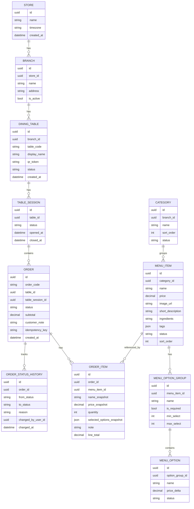

# Data Model và API Spec high-level

## 1. Mục tiêu
Tài liệu này mô tả mô hình dữ liệu và API ở mức đủ để backend/frontend thống nhất khi triển khai prototype. Đây chưa phải OpenAPI hoàn chỉnh nhưng đủ làm hợp đồng kỹ thuật ban đầu.

## 2. ERD đề xuất


## 3. Enum chuẩn
| Enum | Giá trị |
|---|---|
| `menu_item.status` | `ACTIVE`, `SOLD_OUT`, `HIDDEN` |
| `category.status` | `ACTIVE`, `HIDDEN` |
| `table.status` | `ACTIVE`, `INACTIVE` |
| `table_session.status` | `OPEN`, `SERVING`, `CLOSED` |
| `order.status` | `NEW`, `PREPARING`, `READY`, `SERVED`, `CANCELLED` |
| `user.role` | `ADMIN`, `MANAGER`, `KITCHEN`, `STAFF` |

## 4. Entity notes
| Entity | Ghi chú quan trọng |
|---|---|
| `DINING_TABLE` | QR token phải unique và khó đoán. |
| `TABLE_SESSION` | Gom các order trong cùng lượt khách; reset bàn đóng session hiện tại. |
| `MENU_ITEM` | Giá hiện hành dùng để hiển thị; order item lưu snapshot khi chốt. |
| `ORDER` | `idempotency_key` unique theo table/session/client để chống trùng. |
| `ORDER_ITEM` | Không phụ thuộc menu sau khi order đã tạo. |
| `ORDER_STATUS_HISTORY` | Hữu ích cho audit, debug demo và tranh chấp vận hành. |

## 5. API Customer
### 5.1. Resolve QR
`GET /api/public/qr/{qr_token}`

Response 200:
```json
{
  "table": {
    "id": "tbl_05",
    "displayName": "Bàn 05"
  },
  "branch": {
    "id": "branch_01",
    "name": "Bếp Nhà Mình"
  },
  "session": {
    "id": "sess_abc",
    "status": "OPEN"
  }
}
```

### 5.2. Get menu
`GET /api/public/branches/{branch_id}/menu`

Response 200:
```json
{
  "categories": [
    {
      "id": "cat_noodle",
      "name": "Món chính",
      "items": [
        {
          "id": "item_01",
          "name": "Bún bò đặc biệt",
          "price": 65000,
          "imageUrl": "/images/bun-bo.jpg",
          "shortDescription": "Tô lớn, nhiều topping",
          "tags": ["bestseller"],
          "status": "ACTIVE"
        }
      ]
    }
  ]
}
```

### 5.3. Submit order
`POST /api/public/orders`

Request:
```json
{
  "qrToken": "qr_table_05_xxx",
  "tableSessionId": "sess_abc",
  "idempotencyKey": "client-generated-key",
  "customerNote": "Mang ra cùng lúc nếu được",
  "items": [
    {
      "menuItemId": "item_01",
      "quantity": 2,
      "selectedOptions": [
        { "optionId": "opt_less_spicy", "name": "Ít cay", "priceDelta": 0 }
      ],
      "note": "Không hành"
    }
  ]
}
```

Response 201:
```json
{
  "order": {
    "id": "ord_001",
    "orderCode": "B05-001",
    "status": "NEW",
    "subtotal": 130000,
    "createdAt": "2026-04-16T10:00:00+07:00"
  }
}
```

Validation errors:
| HTTP | Code | Mô tả |
|---:|---|---|
| 400 | `EMPTY_CART` | Giỏ rỗng |
| 400 | `INVALID_OPTION` | Thiếu/sai option bắt buộc |
| 409 | `ITEM_SOLD_OUT` | Món đã tạm hết |
| 409 | `DUPLICATE_SUBMISSION` | Request trùng đã có order, nên trả lại order cũ nếu có thể |
| 404 | `INVALID_QR` | QR token không hợp lệ |

### 5.4. Get order tracking
`GET /api/public/orders/{order_id}?qrToken={qr_token}`

Response 200:
```json
{
  "orderCode": "B05-001",
  "tableDisplayName": "Bàn 05",
  "customerStatus": "Đang chuẩn bị",
  "internalStatus": "PREPARING",
  "items": [
    { "name": "Bún bò đặc biệt", "quantity": 2, "note": "Không hành" }
  ],
  "subtotal": 130000
}
```

## 6. API KDS/Admin
### 6.1. List active orders
`GET /api/admin/orders?status=active&branchId=branch_01`

Response 200:
```json
{
  "orders": [
    {
      "id": "ord_001",
      "orderCode": "B05-001",
      "tableDisplayName": "Bàn 05",
      "status": "NEW",
      "createdAt": "2026-04-16T10:00:00+07:00",
      "items": [
        {
          "name": "Bún bò đặc biệt",
          "quantity": 2,
          "options": ["Ít cay"],
          "note": "Không hành"
        }
      ]
    }
  ]
}
```

### 6.2. Update order status
`PATCH /api/admin/orders/{order_id}/status`

Request:
```json
{
  "toStatus": "PREPARING",
  "reason": null
}
```

Rules:
| From | Allowed to |
|---|---|
| `NEW` | `PREPARING`, `CANCELLED` |
| `PREPARING` | `READY`, `CANCELLED` |
| `READY` | `SERVED` |
| `SERVED` | Không chuyển tiếp trong flow thường |
| `CANCELLED` | Không chuyển tiếp trong flow thường |

### 6.3. Manage menu item status
`PATCH /api/admin/menu-items/{menu_item_id}/status`

Request:
```json
{ "status": "SOLD_OUT" }
```

### 6.4. Reset table session
`POST /api/admin/tables/{table_id}/reset-session`

Response 200:
```json
{
  "closedSessionId": "sess_abc",
  "newSessionStatus": "READY_FOR_NEXT_GUEST"
}
```

## 7. API Admin CRUD tối thiểu
| Method | Endpoint | Mục đích |
|---|---|---|
| GET | `/api/admin/categories` | Danh sách danh mục |
| POST | `/api/admin/categories` | Tạo danh mục |
| PATCH | `/api/admin/categories/{id}` | Sửa/ẩn danh mục |
| GET | `/api/admin/menu-items` | Danh sách món |
| POST | `/api/admin/menu-items` | Tạo món |
| PATCH | `/api/admin/menu-items/{id}` | Sửa món |
| DELETE | `/api/admin/menu-items/{id}` | Xóa mềm/ẩn món |
| GET | `/api/admin/tables` | Danh sách bàn |
| POST | `/api/admin/tables` | Tạo bàn và QR token |
| PATCH | `/api/admin/tables/{id}` | Sửa bàn |

## 8. Realtime events đề xuất
| Event | Payload chính | Consumer |
|---|---|---|
| `order.created` | order id, code, table, items, status | KDS/Admin |
| `order.status_changed` | order id, from, to, customer label | Customer/KDS/Admin |
| `menu_item.status_changed` | item id, status | Customer/Admin |
| `table.session_reset` | table id, old session id | Admin/Customer nếu đang mở phiên cũ |

## 9. Idempotency design
| Thành phần | Khuyến nghị |
|---|---|
| Key tạo ở client | UUID lưu cùng request submit |
| Unique constraint | `(table_session_id, idempotency_key)` hoặc `(qr_token_scope, idempotency_key)` |
| Retry behavior | Nếu key đã có order, trả lại order đó với 200/201 nhất quán |
| UI behavior | Disable nút chốt đơn khi đang gửi; nếu timeout, cho retry cùng key |

## 10. Seed data cho demo
| Loại | Số lượng đề xuất |
|---|---:|
| Store | 1 |
| Branch | 1 |
| Tables | 5-10 |
| Categories | 4-6 |
| Menu items | 15-25 |
| Sold out items | 2 |
| Demo orders | 3-5 để KDS có dữ liệu sẵn |
