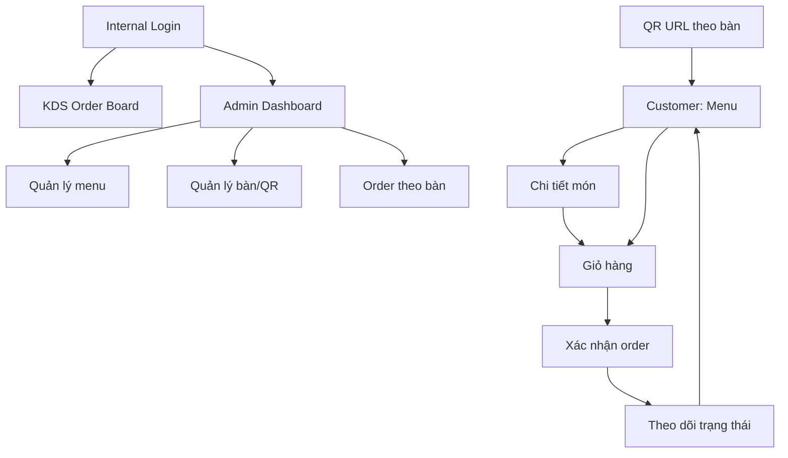

# UX Flow và Wireframe Scope

## 1. Mục tiêu UX
UX prototype cần làm cho khách hàng nhìn thấy flow gọi món tại bàn đơn giản, rõ, nhanh. Với bếp/quầy, UX cần ưu tiên khả năng đọc và thao tác nhanh hơn yếu tố trang trí.

## 2. Sitemap


## 3. Customer flow
### 3.1. QR landing/menu
Mục tiêu: khách biết mình đang ở đúng bàn và có thể bắt đầu chọn món ngay.

Thông tin cần có:
| Khu vực | Nội dung |
|---|---|
| Header | Tên quán, `Bàn 05`, icon giỏ |
| Search/filter | Tìm món, danh mục |
| Category tabs | Món chính, đồ uống, tráng miệng, combo |
| Menu cards | Ảnh, tên, mô tả ngắn, giá, trạng thái, nút thêm |
| Sticky cart | Số món trong giỏ, tổng tạm tính, CTA xem giỏ |

### 3.2. Chi tiết món
Thông tin cần có:
| Khu vực | Nội dung |
|---|---|
| Ảnh món | Ảnh lớn hoặc placeholder |
| Tên/giá | Nổi bật |
| Mô tả | Ngắn, dễ hiểu |
| Tags | Cay, chay, bestseller, trẻ em nếu có |
| Option | Size/topping/mức cay nếu có |
| Ghi chú | Placeholder: `Ví dụ: ít cay, không hành...` |
| CTA | `Thêm vào giỏ` hoặc disabled nếu tạm hết |

### 3.3. Giỏ hàng
Thông tin cần có:
| Khu vực | Nội dung |
|---|---|
| Header | `Giỏ hàng - Bàn 05` |
| Danh sách item | Tên, option, ghi chú, số lượng, giá dòng |
| Tổng tạm tính | Không gọi là thanh toán nếu MVP không thu tiền |
| CTA chính | `Gửi order cho quán` |
| Warning | `Bạn có thể gọi thêm sau bằng order bổ sung.` |

### 3.4. Order success/tracking
Thông tin cần có:
| Khu vực | Nội dung |
|---|---|
| Confirmation | `Đơn B05-001 đã được tiếp nhận` |
| Status timeline | Tiếp nhận -> Đang chuẩn bị -> Sẵn sàng -> Đã phục vụ |
| Order summary | Món, số lượng, ghi chú, tổng tạm tính |
| CTA | `Gọi thêm món`, `Làm mới trạng thái` |

## 4. KDS flow
### 4.1. Order board
Mục tiêu: bếp/quầy nhìn một phát biết cần làm gì.

Layout đề xuất:
| Cột/khu vực | Nội dung |
|---|---|
| Mới nhận | Order `NEW`, ưu tiên trên cùng theo thời gian |
| Đang chuẩn bị | Order `PREPARING` |
| Sẵn sàng | Order `READY` |
| Đã phục vụ/hủy | Có thể ở tab riêng để giảm nhiễu |

Card order cần có:
| Thành phần | Ghi chú UX |
|---|---|
| Bàn | Rất lớn, ví dụ `Bàn 05` |
| Mã order | Nhỏ hơn bàn nhưng dễ đối chiếu |
| Thời gian | Hiển thị `5 phút trước` hoặc timestamp |
| Items | Mỗi item có số lượng lớn: `2x Bún bò đặc biệt` |
| Ghi chú | Badge nổi bật như `Không hành` |
| CTA trạng thái | Một nút chính theo bước tiếp theo |

## 5. Admin flow
### 5.1. Dashboard vận hành
| Khu vực | Nội dung |
|---|---|
| Summary | Số order mới, đang chuẩn bị, bàn đang mở |
| Order list | Lọc theo bàn/trạng thái |
| Table sessions | Bàn đang mở, nút reset |

### 5.2. Quản lý menu
| Khu vực | Nội dung |
|---|---|
| Danh sách món | Tên, danh mục, giá, trạng thái |
| Quick actions | Active/Sold out/Hidden |
| Form món | Tên, giá, ảnh, mô tả, tags, option cơ bản |
| Warning | Đổi giá/trạng thái không làm thay đổi order lịch sử |

### 5.3. Quản lý bàn/QR
| Khu vực | Nội dung |
|---|---|
| Danh sách bàn | Mã bàn, trạng thái, QR token/URL |
| QR action | Copy URL, xem QR, regenerate nếu cần quyền cao |
| Session action | Reset phiên bàn |

## 6. Low-fi wireframe text
### 6.1. Customer menu mobile
```text
+------------------------------------------------+
| Bếp Nhà Mình                     Bàn 05   Giỏ |
| [Tìm món yêu thích...]                         |
| [Món chính] [Đồ uống] [Combo] [Tráng miệng]   |
|                                                |
| [Ảnh]  Bún bò đặc biệt              65.000đ   |
|        Tô lớn, nhiều topping                  |
|        [Bestseller]                 [Thêm]    |
|                                                |
| [Ảnh]  Trà đào cam sả               35.000đ   |
|        Mát, ít ngọt                           |
|                                      [Thêm]   |
|                                                |
| 2 món trong giỏ              Tạm tính 100.000đ|
| [Xem giỏ]                                      |
+------------------------------------------------+
```

### 6.2. KDS card
```text
+-----------------------------+
| BÀN 05              B05-001 |
| Mới nhận - 2 phút trước     |
|                             |
| 2x Bún bò đặc biệt          |
|    Option: Ít cay           |
|    Ghi chú: Không hành      |
| 1x Trà đào cam sả           |
|                             |
| [Bắt đầu chuẩn bị] [Hủy]    |
+-----------------------------+
```

### 6.3. Admin menu row
```text
| Bún bò đặc biệt | Món chính | 65.000đ | ACTIVE   | [Tạm hết] [Sửa] |
| Gỏi cuốn tôm    | Món nhẹ   | 45.000đ | SOLD_OUT | [Bán lại] [Sửa] |
```

## 7. UX rules quan trọng
| ID | Rule |
|---|---|
| UX-01 | Số bàn phải luôn hiển thị rõ trên customer app. |
| UX-02 | Nút chính chỉ nên có một hành động nổi bật mỗi màn hình. |
| UX-03 | KDS dùng chữ lớn, tương phản cao, ít thông tin thừa. |
| UX-04 | Thông báo lỗi phải nói khách cần làm gì tiếp theo. |
| UX-05 | Trạng thái món tạm hết không chỉ dùng màu; cần text rõ. |
| UX-06 | Nếu dùng polling, có dấu hiệu `Cập nhật lần cuối` hoặc nút refresh. |

## 8. Microcopy đề xuất
| Ngữ cảnh | Text |
|---|---|
| QR sai | `Mã QR không hợp lệ. Vui lòng gọi nhân viên để được hỗ trợ.` |
| Giỏ rỗng | `Bạn chưa chọn món nào.` |
| Submit thành công | `Đơn của bạn đã được gửi cho quán.` |
| Đang gửi | `Đang gửi order, vui lòng chờ trong giây lát...` |
| Món tạm hết | `Món này hiện đang tạm hết.` |
| Retry | `Kết nối chưa ổn định. Bạn có thể thử gửi lại, hệ thống sẽ không tạo trùng đơn.` |
| Gọi thêm | `Bạn vẫn có thể gọi thêm món trong cùng bàn.` |

## 9. Demo data gợi ý
| Danh mục | Món mẫu |
|---|---|
| Món chính | Bún bò đặc biệt, Cơm gà xối mỡ, Mì trộn bò, Phở tái nạm |
| Món nhẹ | Gỏi cuốn tôm, Khoai tây chiên, Salad gà |
| Đồ uống | Trà đào cam sả, Cà phê sữa đá, Nước ép dưa hấu |
| Combo | Combo trưa nhanh, Combo gia đình |
| Tráng miệng | Chè khúc bạch, Flan caramel |

## 10. Accessibility cơ bản
| Hạng mục | Yêu cầu |
|---|---|
| Font size | Body tối thiểu 16px trên mobile |
| Touch target | Nút chính tối thiểu khoảng 44px cao |
| Contrast | Text chính đủ tương phản với nền |
| Loading | Có trạng thái loading cho submit/order refresh |
| Error | Không chỉ dùng màu đỏ; cần text giải thích |
