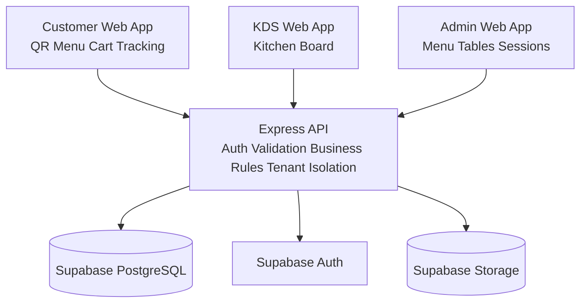

# BE MVP Spec — Node.js + Express + TypeScript
## Bếp Nhà Mình — QR Ordering System

> Phiên bản: 1.1  
> Ngày: 18/04/2026  
> Trạng thái: Draft chốt để bắt đầu phase code BE MVP  
> Audience: PM, PO, BA, FE dev, BE dev, QA, AI coding agent

---

## 1. Mục tiêu tài liệu

Tài liệu này là bản handoff kỹ thuật chính thức cho phase backend MVP production đầu tiên của dự án **Bếp Nhà Mình**.  
Mục tiêu là chuyển prototype hiện tại từ mô hình local-state sang một sản phẩm:

- có backend thật
- có database thật
- có auth nội bộ thật
- có thể deploy staging/production
- có thể phục vụ **nhiều quán cùng dùng** theo mô hình multi-tenant SaaS

Tài liệu này không phải báo cáo tổng kết, mà là **spec để bắt đầu code backend ngay**.

### 1.1. Source of truth theo thứ tự ưu tiên

Khi có xung đột, ưu tiên tài liệu theo thứ tự sau:

1. `docs_prototype/02_quy_trinh_nghiep_vu_thong_nhat.md`
2. `docs_prototype/03_prd_mvp_va_backlog_po.md`
3. `docs_prototype/06_data_model_api_spec.md`
4. `docs_prototype/11_prototype_uat_qa_ai_review_checklist.md`
5. `docs_prototype/13_tong_ket_du_an_bao_cao_pm_po_ba.md`
6. `docs_prototype/05_kien_truc_ky_thuat_cto.md`
7. FE hiện trạng trong `web-prototype-react`

### 1.2. Phạm vi phase này

Phase này nhằm đưa hệ thống lên mức **MVP production multi-tenant**, bao gồm:

- QR resolve
- menu số
- submit order
- tracking order
- KDS xử lý đơn
- admin quản lý menu, bàn, session
- auth nội bộ
- tenant isolation giữa nhiều quán
- deploy staging/production cơ bản

Không nhằm giải quyết:

- payment
- printer integration
- POS integration
- loyalty
- AI upsell
- mobile-native app

---

## 2. Tình hình hiện tại và production gap

### 2.1. Cái đã có

Theo `13_tong_ket_du_an_bao_cao_pm_po_ba.md`, prototype đã hoàn thành:

- full core flow customer
- KDS flow
- admin menu/tables/dashboard ở mức demo
- business rules cốt lõi
- design system và UI/UX đủ tốt để tái sử dụng

### 2.2. Cái chưa có

Các production gap critical hiện tại:

- chưa có backend API thật
- chưa có PostgreSQL
- chưa có auth thật
- chưa có cross-device sync thật
- chưa có tenant isolation thật giữa nhiều quán
- chưa có deploy stack vận hành thật

### 2.3. Kết luận dùng cho phase BE

Frontend hiện tại đủ tốt để giữ lại.  
Phase BE phải tập trung vào việc **thay data layer và auth layer**, không redesign lại sản phẩm.

---

## 3. Phân tích phương án kỹ thuật

### 3.1. Phương án A — Supabase-only

#### Mô tả

- FE gọi trực tiếp Supabase
- Auth dùng Supabase Auth
- DB dùng Supabase PostgreSQL
- Realtime dùng Supabase Realtime
- Logic nghiệp vụ nằm rải giữa FE, SQL, policies, Edge Functions

#### Ưu điểm

- setup nhanh
- ít hạ tầng
- phù hợp demo hoặc app CRUD đơn giản

#### Nhược điểm

- business rules order/session/idempotency dễ bị phân tán
- khó giữ spec nghiệp vụ chặt
- khó học backend theo hướng service riêng
- tenant isolation dễ bị phụ thuộc quá nhiều vào policy/FE discipline
- khó kiểm soát khi dự án lớn dần

#### Kết luận

Không chọn cho phase này.

---

### 3.2. Phương án B — Custom Node API hoàn toàn

#### Mô tả

- backend Express riêng
- PostgreSQL riêng
- auth tự quản lý
- storage tự chọn
- realtime tự dựng

#### Ưu điểm

- kiểm soát tối đa
- kiến trúc sạch về lâu dài
- dễ scale khi sản phẩm lớn hơn và nhiều tenant hơn

#### Nhược điểm

- setup chậm hơn
- nhiều việc ops hơn
- thời gian lên MVP đầu tiên dài hơn

#### Kết luận

Không chọn cho MVP đầu tiên.

---

### 3.3. Phương án C — Hybrid

#### Mô tả

- backend riêng bằng Node.js + Express
- database dùng Supabase PostgreSQL
- auth dùng Supabase Auth
- storage dùng Supabase Storage
- business logic tập trung ở backend Express

#### Ưu điểm

- bạn vẫn code backend thật bằng Node.js
- nhanh hơn custom full stack
- business rules không bị nhét vào FE/localStorage
- tenant isolation có thể enforce tập trung ở backend
- deploy production-friendly hơn prototype rất nhiều
- vẫn dễ nâng cấp về sau

#### Nhược điểm

- phải quản lý 2 lớp: backend service + Supabase platform

#### Kết luận

**Chọn phương án C — Hybrid** cho phase MVP production.

---

### 3.4. Vì sao chọn Express thay vì Fastify

Phase này chốt:

- `Node.js + Express + TypeScript + Zod + Prisma`

Không chọn Fastify lúc này vì:

- Express dễ học hơn với người mới
- tài liệu và ví dụ nhiều hơn
- onboarding nhanh hơn
- đủ tốt cho MVP multi-tenant quy mô nhỏ và vừa
- tránh tăng độ khó kỹ thuật không cần thiết ở giai đoạn đầu

Fastify vẫn là hướng nâng cấp được sau này nếu cần, nhưng **không phải lựa chọn tối ưu cho phase học + triển khai MVP đầu tiên**.

---

## 4. Stack kỹ thuật chốt cho MVP

### 4.1. Backend stack

- Runtime: `Node.js 22 LTS`
- Framework: `Express`
- Language: `TypeScript`
- Validation: `Zod`
- ORM: `Prisma`
- Database: `Supabase PostgreSQL`
- Auth: `Supabase Auth`
- Storage: `Supabase Storage`
- Logging: `pino`
- Config/env: `dotenv`
- Testing: `Vitest` + `Supertest`

### 4.2. Frontend stack giữ nguyên

- `React + Vite + TypeScript`
- UI giữ nguyên
- bỏ shared localStorage làm source of truth
- giữ cart local per-device

### 4.3. Deploy stack chốt

- FE: `Vercel`
- BE: `Railway`
- DB/Auth/Storage: `Supabase`

### 4.4. Realtime strategy chốt

MVP v1 dùng:

- polling `3 giây` cho KDS
- polling `3 giây` cho customer tracking
- admin refetch theo action hoặc polling nhẹ nếu cần

Không dùng WebSocket ở v1.  
Lý do: giảm rủi ro delivery, vẫn đủ tốt cho MVP multi-tenant đầu tiên.

---

## 5. Kiến trúc kỹ thuật MVP



### 5.1. Server responsibilities

Backend Express chịu trách nhiệm:

- xác thực request nội bộ
- verify JWT từ Supabase Auth
- validate request bằng Zod
- enforce business rules
- enforce tenant isolation theo store/branch
- resolve QR token
- mở/đóng `tableSession`
- tạo order atomically
- generate `orderCode`
- lưu snapshot order items
- cập nhật trạng thái đơn
- quản lý menu/category/table
- ghi lịch sử trạng thái order
- trả lỗi chuẩn hoá cho FE

### 5.2. Client responsibilities

Frontend chịu trách nhiệm:

- giữ cart local per-device
- giữ `clientSessionId`
- gọi API
- hiển thị loading/error/empty states
- polling tracking và KDS
- điều hướng route

Frontend không còn chịu trách nhiệm:

- lưu shared orders/menu/tables làm source of truth
- tự enforce business rules ở mức cuối cùng
- auth nội bộ bằng PIN
- tự quyết định tenant scope

---

## 6. Cấu trúc repository/backend đề xuất

### 6.1. Folder mới đề xuất

Tạo service backend mới:

`backend-api/`

### 6.2. Cấu trúc đề xuất

```text
backend-api/
├── src/
│   ├── app.ts
│   ├── server.ts
│   ├── config/
│   ├── modules/
│   │   ├── auth/
│   │   ├── tenant/
│   │   ├── public/
│   │   ├── internal/
│   │   ├── orders/
│   │   ├── menu/
│   │   ├── tables/
│   │   └── sessions/
│   ├── middlewares/
│   ├── lib/
│   ├── validators/
│   ├── types/
│   └── utils/
├── prisma/
│   ├── schema.prisma
│   ├── migrations/
│   └── seed.ts
├── tests/
├── package.json
├── tsconfig.json
└── .env.example
```

### 6.3. Module boundaries

- `auth`: login/logout/me, role guard
- `tenant`: resolve store/branch context, tenant-scoped query helpers
- `public`: QR resolve, menu read, order submit, tracking
- `internal`: admin and KDS protected routes
- `orders`: order creation, order status, history
- `tables`: dining table CRUD, reset session
- `sessions`: resolve/open/close session logic
- `menu`: category/menu item CRUD and read

---

## 7. Business rules backend phải enforce

Backend là nơi chốt rule cuối cùng. FE chỉ hỗ trợ UX.

### 7.1. Tenant boundary

- `store` là tenant root.
- `branch` thuộc về đúng một `store`.
- mọi dữ liệu nghiệp vụ phải scope được tới `branch` và truy ngược được tới `store`.
- user nội bộ chỉ được truy cập dữ liệu thuộc tenant của mình.
- backend không được hardcode `store` hoặc `branch` mặc định ngoài seed/demo mode.

### 7.2. QR và session

- Mỗi `qr_token` map tới đúng một bàn trong đúng `branch/store`.
- Một bàn chỉ có tối đa một `tableSession` đang mở.
- Khách quét QR **không bắt buộc** mở session ngay.
- Session sẽ được mở atomically ở lần submit order đầu tiên nếu chưa có.
- Nếu có session đang mở thì order mới phải gắn vào session hiện tại.

### 7.3. Cart/order submit

- Chỉ món `ACTIVE` mới được chốt.
- `SOLD_OUT` bị chặn ở server dù FE có hiển thị sai.
- Option bắt buộc phải đủ.
- Submit phải idempotent.
- Order phải lưu snapshot:
  - tên món
  - giá
  - option đã chọn
  - note
- Sau khi chốt, order không được sửa trực tiếp.
- Gọi thêm món tạo order mới cùng `tableSession`.

### 7.4. Order status

Allowed transitions:

- `NEW -> PREPARING`
- `NEW -> CANCELLED`
- `PREPARING -> READY`
- `PREPARING -> CANCELLED`
- `READY -> SERVED`

Không cho phép:

- revert status trong flow thường
- update từ `SERVED`
- update từ `CANCELLED`

### 7.5. Reset bàn

- Reset đóng session hiện tại.
- Không xóa order history.
- Mặc định không cho reset nếu còn order ở trạng thái:
  - `NEW`
  - `PREPARING`
  - `READY`
- Có thể bổ sung force reset ở phase sau, nhưng **không nằm trong MVP v1**.

---

## 8. Data model production

## 8.1. Bảng dữ liệu bắt buộc

### `stores`

- `id`
- `name`
- `timezone`
- `created_at`

### `branches`

- `id`
- `store_id`
- `name`
- `address`
- `is_active`
- `created_at`

### `users`

- `id`
- `supabase_auth_user_id`
- `store_id`
- `default_branch_id`
- `display_name`
- `email`
- `is_active`
- `created_at`

### `user_roles`

- `id`
- `user_id`
- `role`
- `store_id`
- `branch_id`
- `created_at`

### `dining_tables`

- `id`
- `branch_id`
- `table_code`
- `display_name`
- `qr_token`
- `status`
- `created_at`

### `table_sessions`

- `id`
- `table_id`
- `status`
- `opened_at`
- `closed_at`
- `order_counter`
- `created_at`

### `categories`

- `id`
- `branch_id`
- `name`
- `sort_order`
- `status`
- `created_at`
- `updated_at`

### `menu_items`

- `id`
- `category_id`
- `name`
- `price`
- `image_url`
- `short_description`
- `ingredients`
- `tags_json`
- `status`
- `sort_order`
- `created_at`
- `updated_at`

### `menu_option_groups`

- `id`
- `menu_item_id`
- `name`
- `is_required`
- `min_select`
- `max_select`
- `sort_order`

### `menu_options`

- `id`
- `option_group_id`
- `name`
- `price_delta`
- `status`
- `sort_order`

### `orders`

- `id`
- `store_id`
- `branch_id`
- `table_id`
- `table_session_id`
- `client_session_id`
- `order_code`
- `status`
- `subtotal`
- `customer_note`
- `idempotency_key`
- `created_at`
- `updated_at`

### `order_items`

- `id`
- `order_id`
- `menu_item_id`
- `name_snapshot`
- `price_snapshot`
- `quantity`
- `selected_options_snapshot_json`
- `note`
- `line_total`

### `order_status_history`

- `id`
- `order_id`
- `from_status`
- `to_status`
- `reason`
- `changed_by_user_id`
- `changed_at`

---

## 8.2. Constraints bắt buộc

- `dining_tables.qr_token` unique
- `dining_tables.table_code` unique trong một `branch`
- `orders.idempotency_key` unique
- `orders.order_code` unique trong một `branch`
- một bàn không có hơn một `table_session` active cùng lúc
- internal query luôn phải filter theo `store_id`

### 8.3. Indexes khuyến nghị

- `orders(table_session_id, created_at desc)`
- `orders(store_id, branch_id, created_at desc)`
- `orders(status, created_at asc)`
- `order_status_history(order_id, changed_at desc)`
- `menu_items(category_id, status, sort_order)`
- `table_sessions(table_id, status, opened_at desc)`
- `users(store_id, email)`

### 8.4. Prisma note

Trong `schema.prisma`:

- dùng enum cho `OrderStatus`, `MenuItemStatus`, `CategoryStatus`, `TableStatus`, `SessionStatus`, `UserRole`
- tách `selected_options_snapshot` thành `Json`
- `tags_json` dùng `Json`
- model phải thể hiện rõ `Store -> Branch -> DiningTable/TableSession/Orders`

---

## 9. Auth và quyền

## 9.1. Auth model chốt

- Customer: không đăng nhập
- Admin/KDS: đăng nhập bằng email/password
- Provider auth: `Supabase Auth`
- Backend Express verify JWT của Supabase trên mọi route internal
- Sau khi verify JWT, backend phải load tenant context của user

## 9.2. Roles

- `ADMIN`
- `MANAGER`
- `KITCHEN`

## 9.3. Quyền theo role

### `KITCHEN`

- xem active orders
- cập nhật trạng thái order
- hủy order nếu rule cho phép
- chỉ trong branch/store được phân quyền

### `MANAGER`

- toàn bộ quyền của `KITCHEN`
- reset bàn
- xem history
- xem dashboard nội bộ
- scope theo tenant được gán

### `ADMIN`

- toàn bộ quyền của `MANAGER`
- CRUD category
- CRUD menu item
- CRUD dining table
- quản trị user/role nội bộ nếu cần ở phase sau
- không được truy cập dữ liệu tenant khác

## 9.4. Login strategy

Chốt triển khai:

- FE gọi `POST /api/auth/login`
- backend gọi Supabase Auth để sign in
- backend trả session token pair + user profile + roles + tenant context
- FE lưu token an toàn theo mô hình bearer token
- `POST /api/auth/logout` chỉ dùng để clear session phía FE và nếu có thì revoke token/session qua Supabase

---

## 10. API contract chốt

## 10.1. Response format

### Success

```json
{
  "data": {}
}
```

### Error

```json
{
  "error": {
    "code": "SOME_ERROR_CODE",
    "message": "Thông điệp lỗi rõ ràng",
    "details": {}
  }
}
```

`details` là optional.

---

## 10.2. Public customer APIs

### `GET /api/public/qr/:qrToken`

#### Mục đích

- resolve QR token
- trả về bàn
- trả về branch
- trả về store
- trả về session đang mở nếu có

#### Response

```json
{
  "data": {
    "table": {
      "id": "tbl_05",
      "tableCode": "table-05",
      "displayName": "Bàn 05"
    },
    "branch": {
      "id": "branch_01",
      "name": "Bếp Nhà Mình"
    },
    "store": {
      "id": "store_01",
      "name": "Bếp Nhà Mình"
    },
    "activeSession": {
      "id": "sess_001",
      "status": "OPEN"
    }
  }
}
```

`activeSession` có thể là `null`.

### `GET /api/public/branches/:branchId/menu`

#### Mục đích

- trả category + menu items đang hiển thị
- giữ tương thích với FE hiện tại

#### Rule

- `ACTIVE` hiển thị và order được
- `SOLD_OUT` hiển thị nhưng disabled
- `HIDDEN` không hiển thị

### `POST /api/public/orders`

#### Request

```json
{
  "qrToken": "qr_table_05_xxx",
  "clientSessionId": "cs_abc123",
  "tableSessionId": "sess_001",
  "idempotencyKey": "cs_abc123_1713311111_9f8a",
  "customerNote": "Mang ra cùng lúc nếu được",
  "items": [
    {
      "menuItemId": "item_01",
      "quantity": 2,
      "selectedOptions": [
        {
          "optionId": "opt_01",
          "name": "Ít cay",
          "priceDelta": 0
        }
      ],
      "note": "Không hành"
    }
  ]
}
```

#### Rule chốt

- backend tự resolve `tableId`
- backend tự resolve `branchId` và `storeId`
- backend tự mở session nếu chưa có session đang mở
- `tableSessionId` nếu gửi lên chỉ là hint để detect stale state
- nếu `idempotencyKey` đã tồn tại thì trả lại order cũ

#### Success response

```json
{
  "data": {
    "order": {
      "id": "ord_001",
      "orderCode": "B05-001",
      "status": "NEW",
      "subtotal": 130000,
      "createdAt": "2026-04-18T10:00:00+07:00",
      "tableSessionId": "sess_001"
    }
  }
}
```

#### Error codes tối thiểu

- `INVALID_QR`
- `EMPTY_CART`
- `INVALID_OPTION`
- `ITEM_SOLD_OUT`
- `STALE_SESSION`
- `DUPLICATE_SUBMISSION`
- `INTERNAL_ERROR`

### `GET /api/public/orders/:orderId?qrToken=...`

#### Mục đích

- tracking cho customer

#### Trả về

- `orderCode`
- `tableDisplayName`
- `customerStatus`
- `internalStatus`
- `items`
- `subtotal`
- `updatedAt`
- `sessionStatus`
- `branchId`
- `storeId`

---

## 10.3. Internal authenticated APIs

### `POST /api/auth/login`

- input: `email`, `password`
- output: token pair + profile + roles + store/branch context

### `POST /api/auth/logout`

- clear/revoke session nội bộ

### `GET /api/internal/me`

- trả user hiện tại + roles + store context + branch context

### `GET /api/internal/orders/active`

- dùng cho KDS
- mặc định scope theo tenant của user
- cho phép lọc theo `branchId` nếu role hợp lệ và branch thuộc cùng store
- trả các order trạng thái:
  - `NEW`
  - `PREPARING`
  - `READY`

### `PATCH /api/internal/orders/:id/status`

#### Request

```json
{
  "toStatus": "PREPARING",
  "reason": null
}
```

#### Rule

- kiểm tra role
- kiểm tra allowed transitions
- nếu `toStatus = CANCELLED` thì `reason` là required
- ghi `order_status_history`

### `GET /api/internal/orders/history`

#### Query tối thiểu

- `dateFrom`
- `dateTo`
- `tableId`
- `status`
- `page`
- `pageSize`
- `branchId`

### CRUD `categories`

- `GET /api/internal/categories`
- `POST /api/internal/categories`
- `PATCH /api/internal/categories/:id`
- `DELETE` không hard delete trong MVP, chỉ chuyển trạng thái `HIDDEN` nếu cần
- mọi thao tác phải tenant-scoped

### CRUD `menu-items`

- `GET /api/internal/menu-items`
- `POST /api/internal/menu-items`
- `PATCH /api/internal/menu-items/:id`
- `PATCH /api/internal/menu-items/:id/status`
- mọi thao tác phải tenant-scoped

### CRUD `dining-tables`

- `GET /api/internal/tables`
- `POST /api/internal/tables`
- `PATCH /api/internal/tables/:id`
- mọi thao tác phải tenant-scoped

### `POST /api/internal/tables/:id/reset-session`

#### Rule

- chỉ `MANAGER` hoặc `ADMIN`
- chỉ reset được nếu không còn order active
- đóng session cũ
- không xóa history
- bàn phải thuộc đúng tenant của user
- response trả:
  - `closedSessionId`
  - `closedAt`
  - `tableStatus`

---

## 11. Order code strategy

Format chốt:

`B[tableNumber]-[sequence]`

Ví dụ:

- `B05-001`
- `B05-002`

### Rule

- counter tăng theo `tableSession`
- khi session mới được mở, counter reset về `001`
- backend generate, frontend không generate

---

## 12. Migration plan từ prototype sang MVP multi-tenant

## 12.1. Phần giữ nguyên

- UI/UX customer
- UI/UX KDS
- UI/UX admin
- brand name `Bếp Nhà Mình`
- typography và design tokens
- route shape chính:
  - `/qr/:tableCode`
  - `/cart`
  - `/order/:id/tracking`
  - `/kds`
  - `/admin`

## 12.2. Phần thay đổi

- bỏ shared localStorage làm source of truth
- bỏ shared Zustand store cho orders/menu/tables
- thay bằng API layer
- bỏ `PINGate`
- thêm login flow cho admin/KDS
- giữ cart local per-device
- thêm tenant-aware API layer cho admin/KDS

## 12.3. FE integration strategy

Khuyến nghị:

- dùng `TanStack Query` cho server state
- dùng local hook/Zustand nhẹ cho:
  - cart
  - clientSessionId
  - local UI state

### Mapping cụ thể

- `MenuPage`
  - gọi QR resolve
  - gọi menu API
- `CartPage`
  - submit order qua API
- `TrackingPage`
  - poll tracking API mỗi 3 giây
- `KDSPage`
  - poll active orders API mỗi 3 giây
- `Admin pages`
  - gọi internal authenticated APIs theo tenant context

---

## 13. Kế hoạch triển khai theo phase

## Sprint 0 — Freeze spec và nền tảng

### Mục tiêu

- khóa toàn bộ quyết định kỹ thuật
- chuẩn bị môi trường phát triển

### Output bắt buộc

- tài liệu này được sign-off nội bộ
- file `.env.example`
- decision log cuối cùng:
  - stack
  - auth
  - session policy
  - reset policy
  - status transitions
  - realtime policy

---

## Sprint 1 — Scaffold backend

### Mục tiêu

- tạo backend chạy được
- có DB schema và seed cơ bản

### Công việc

- scaffold Express + TypeScript
- setup Prisma
- setup Supabase Postgres connection
- setup logging
- setup health endpoint
- setup seed script
- setup auth verification middleware

### Output bắt buộc

- `GET /health` chạy được
- migration chạy được
- seed tạo được:
  - ít nhất `2 stores`
  - mỗi store có ít nhất `1 branch`
  - mỗi branch có tables/menu/categories riêng
  - internal users cho từng tenant

---

## Sprint 2 — Customer APIs

### Mục tiêu

- đưa customer flow lên backend thật

### Công việc

- QR resolve API
- menu API
- create order API
- tracking API
- enforce:
  - sold-out validation
  - required options validation
  - idempotency
  - session open atomically
  - order code generation
  - snapshot order items
  - status history record

### Output bắt buộc

- customer submit order end-to-end qua API
- tracking đọc từ DB thật
- query không lẫn dữ liệu giữa 2 store

---

## Sprint 3 — KDS/Admin APIs

### Mục tiêu

- đưa vận hành nội bộ lên backend thật

### Công việc

- active orders API
- update order status API
- cancel order with reason
- order history API
- category CRUD
- menu item CRUD
- table CRUD
- reset session API

### Output bắt buộc

- KDS xử lý được order thật
- admin đổi sold-out ảnh hưởng menu thật
- admin reset session qua API
- internal API không đọc được dữ liệu tenant khác

---

## Sprint 4 — FE integration

### Mục tiêu

- thay local shared state bằng API thật

### Công việc

- tích hợp auth internal
- thêm login screens
- thay local shared store bằng API + TanStack Query
- giữ cart local
- thêm loading/error states
- thêm polling cho KDS và tracking

### Output bắt buộc

- customer/KDS/admin đều chạy trên dữ liệu backend thật
- tenant context được trả đúng ở auth/internal flows

---

## Sprint 5 — Staging và UAT

### Mục tiêu

- có môi trường staging deploy được
- pass nghiệm thu MVP

### Công việc

- deploy FE lên Vercel
- deploy BE lên Railway
- connect Supabase production-like project
- smoke test đa thiết bị
- UAT theo checklist
- fix blocker

### Output bắt buộc

- có URL staging
- pass UAT critical items
- sẵn sàng onboarding nhiều quán đầu tiên

---

## 14. Test plan

## 14.1. Unit tests backend

- idempotency
- sold-out validation
- required option validation
- order code generation
- status transitions
- reset session rules

## 14.2. Integration tests

- submit order tạo `orders`, `order_items`, `order_status_history`
- submit lại cùng `idempotencyKey` không tạo order trùng
- KDS update status phản ánh đúng tracking response
- admin đổi `SOLD_OUT` ảnh hưởng menu read API
- reset session không làm mất history
- user tenant A không đọc/ghi được dữ liệu tenant B

## 14.3. FE smoke tests

- customer flow
- KDS flow
- admin flow

## 14.4. UAT acceptance bắt buộc

Map trực tiếp theo checklist:

- BF-01 đến BF-08
- BF-11
- KDS-01 đến KDS-05
- ADM-03
- ADM-07
- DATA-01 đến DATA-06
- DEMO-01 đến DEMO-04
- DEMO-07

Nếu có bất kỳ mục Critical nào fail thì kết luận là **No-Go** cho pilot.

---

## 15. Environment và deploy

## 15.1. Environment variables tối thiểu

### Backend

- `PORT`
- `NODE_ENV`
- `DATABASE_URL`
- `SUPABASE_URL`
- `SUPABASE_ANON_KEY`
- `SUPABASE_SERVICE_ROLE_KEY`
- `SUPABASE_JWT_SECRET`
- `APP_BASE_URL`
- `FRONTEND_URL`

### Frontend

- `VITE_API_BASE_URL`
- `VITE_SUPABASE_URL`
- `VITE_SUPABASE_ANON_KEY`

## 15.2. Deploy environments

- `local`
- `staging`
- `production`

## 15.3. Deploy flow

- FE build và deploy lên Vercel
- BE build và deploy lên Railway
- Supabase giữ DB/Auth/Storage
- migration chạy trước khi promote release

---

## 16. Out of scope

Những hạng mục sau **không làm trong phase này**:

- payment
- printer integration
- POS integration
- loyalty
- AI upsell
- review/rating
- push notification production-grade
- mobile-native app

---

## 17. Assumptions

- MVP này là `multi-tenant từ day 1`, phục vụ nhiều quán cùng dùng
- FE hiện tại đủ tốt để tái sử dụng
- backend là `Express service riêng`, không dùng Supabase-only
- polling là chấp nhận được cho MVP v1
- Supabase được dùng như managed platform cho `PostgreSQL + Auth + Storage`
- customer vẫn dùng mobile web qua QR, không cần app native

---

## 18. Definition of Done cho phase BE MVP

Phase backend MVP được coi là hoàn thành khi:

1. Có backend deploy được trên staging
2. Có PostgreSQL schema + migration + seed
3. Customer submit order qua API thật thành công
4. KDS xử lý đơn qua API thật
5. Admin đổi menu/reset session qua API thật
6. Admin/KDS dùng auth thật, không còn PIN prototype
7. FE không còn dùng shared localStorage làm source of truth
8. Tenant isolation giữa các quán được verify bằng test và smoke test
9. Pass các tiêu chí nghiệm thu Critical đã chốt

---

*Tài liệu này là bản chốt kỹ thuật để triển khai backend MVP production cho Bếp Nhà Mình theo stack Node.js + Express + TypeScript.*  
*Nếu có thay đổi scope, phải cập nhật tài liệu này trước khi triển khai tiếp.*
