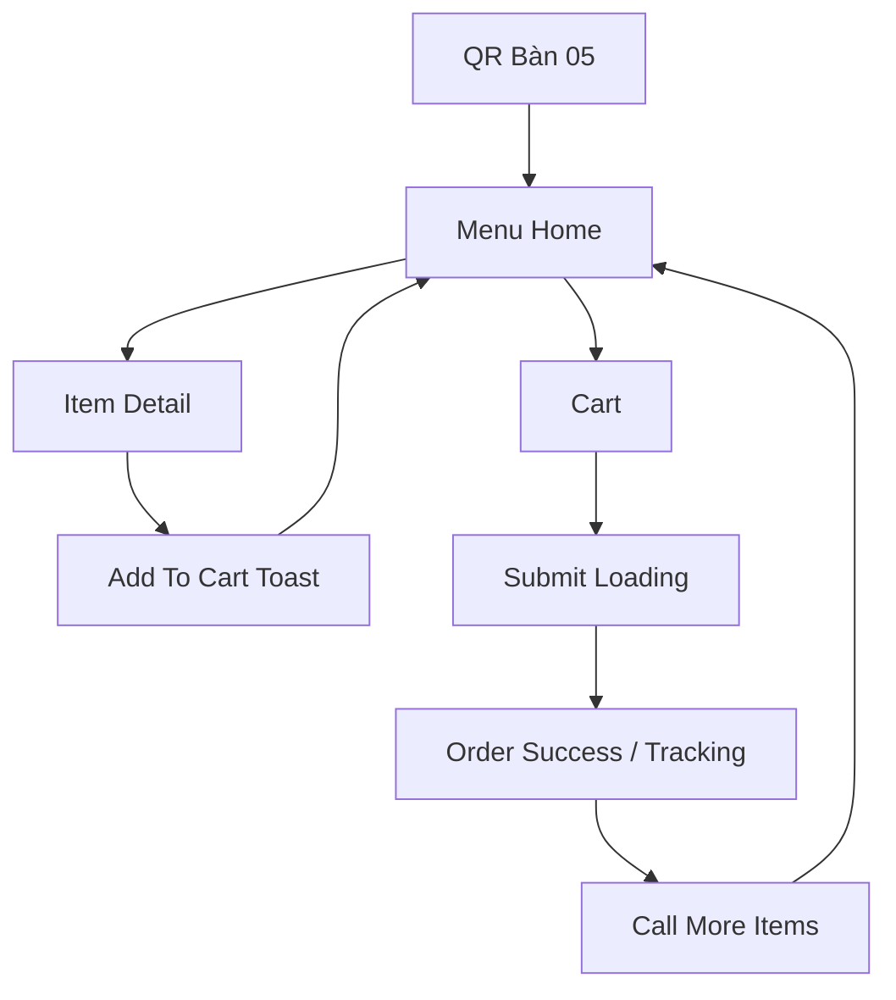
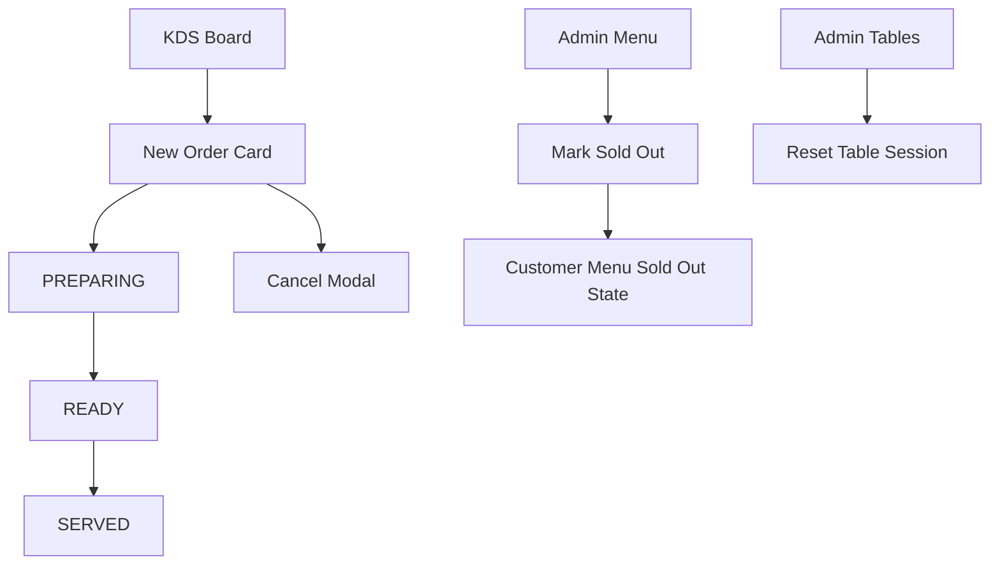

# Screen Inventory và User Flow

## 1. Mục tiêu
File này là checklist màn hình để đối chiếu output từ Stitch MCP và prototype do Antigravity tạo ra. Nếu thiếu các màn hình/state trong file này, demo sẽ dễ đứt mạch.

## 2. Route map prototype
| Route đề xuất | Màn hình | Actor | Ghi chú |
|---|---|---|---|
| `/qr/table-05` | QR landing/Menu | Khách | Link demo chính |
| `/menu?table=05` | Menu home | Khách | Có thể cùng route QR sau khi resolve |
| `/menu/item/:id` | Item detail | Khách | Page hoặc bottom sheet |
| `/cart` | Cart | Khách | Gắn context bàn 05 |
| `/order/:orderId/tracking` | Tracking | Khách | Cập nhật theo status |
| `/kds` | KDS board | Bếp/quầy | Tablet/desktop |
| `/admin` | Admin dashboard | Admin/quản lý | Tổng quan |
| `/admin/menu` | Menu management | Admin | Đổi trạng thái món |
| `/admin/tables` | Table/QR management | Admin/quản lý | Reset bàn, QR |

## 3. Customer flow chi tiết

## 4. KDS/Admin flow chi tiết

## 5. Screen specification
### 5.1. Customer menu home
| Element | Requirement |
|---|---|
| Header | Tên quán, `Bàn 05`, cart icon/count |
| Search | Placeholder `Tìm món yêu thích...` |
| Category tabs | Sticky hoặc horizontal scroll |
| Menu card | Ảnh, tên, mô tả, giá, badge, CTA thêm |
| Sold out card | Disabled CTA, badge `Tạm hết`, vẫn đọc được thông tin |
| Sticky cart | Count, subtotal, CTA `Xem giỏ` |

### 5.2. Item detail
| Element | Requirement |
|---|---|
| Image | Ảnh lớn, crop đẹp |
| Info | Tên, giá, mô tả, tags |
| Options | Option một lựa chọn hoặc nhiều lựa chọn |
| Note | Textarea ngắn, max 200 ký tự trong spec |
| CTA | `Thêm vào giỏ`, loading/add feedback |
| Sold out | CTA disabled, text giải thích |

### 5.3. Cart
| Element | Requirement |
|---|---|
| Header | `Giỏ hàng - Bàn 05` |
| Items | Tên, option, note, quantity stepper, line total |
| Empty state | `Bạn chưa chọn món nào.` + CTA về menu |
| Summary | Subtotal, note tổng nếu có |
| CTA | `Gửi order cho quán` |
| Loading | Disabled CTA, text `Đang gửi order...` |
| Error | Retry an toàn, không tạo trùng đơn |

### 5.4. Tracking
| Element | Requirement |
|---|---|
| Confirmation | `Đơn B05-001 đã được tiếp nhận` |
| Timeline | 4 trạng thái khách hiểu |
| Summary | Món/order code/table/subtotal |
| CTA | `Gọi thêm món`, `Làm mới trạng thái` |
| Refresh info | Có `Cập nhật lần cuối` nếu dùng polling |

### 5.5. KDS board
| Element | Requirement |
|---|---|
| Columns | Mới nhận, Đang chuẩn bị, Sẵn sàng, Đã phục vụ/Hủy |
| Order card | Bàn lớn, mã order, thời gian, items, note |
| Actions | Một CTA chính theo status, action hủy phụ |
| New state | Highlight/pulse nhẹ |
| Empty state | `Chưa có đơn mới` |

### 5.6. Admin dashboard
| Element | Requirement |
|---|---|
| Summary | Order mới, đang chuẩn bị, bàn đang mở, món tạm hết |
| Table sessions | Danh sách bàn đang mở, nút reset |
| Recent orders | Order gần đây, status |

### 5.7. Admin menu
| Element | Requirement |
|---|---|
| Table | Tên món, danh mục, giá, trạng thái |
| Quick action | Tạm hết/Bán lại/Ẩn/Sửa |
| Form | Tên, giá, mô tả, ảnh, tags, status |
| Feedback | Toast sau khi đổi trạng thái |

### 5.8. Admin tables/QR
| Element | Requirement |
|---|---|
| Table list | Bàn 01-05, status, QR URL |
| QR action | Copy URL, xem QR |
| Session action | Reset phiên |
| Warning | Reset không xóa lịch sử order |

## 6. Required UI states
| State | Screen | Must show |
|---|---|---|
| Loading menu | Customer menu | Skeleton/menu loading |
| Empty menu | Customer menu | Message gọi nhân viên |
| Sold out item | Menu/item detail/cart validation | Badge + disabled |
| Add success | Menu/detail | Toast/snackbar |
| Cart empty | Cart | Friendly empty state |
| Submit loading | Cart | Disabled CTA |
| Submit error | Cart | Retry safe message |
| Order new | Tracking/KDS | Status `Đã tiếp nhận` / `Mới nhận` |
| Order preparing | Tracking/KDS | Status synced |
| Order ready | Tracking/KDS | Status synced |
| QR invalid | Customer | Error + gọi nhân viên |
| KDS empty | KDS | No orders |
| Admin saved | Admin | Toast saved |

## 7. Demo data cố định
| Entity | Data |
|---|---|
| Store | Bếp Nhà Mình |
| Table | Bàn 05 |
| Order code | B05-001 |
| Active items | Bún bò đặc biệt, Trà đào cam sả, Cơm gà xối mỡ, Gỏi cuốn tôm |
| Sold out items | Chè khúc bạch, Combo gia đình |
| Note demo | Không hành |

## 8. Prototype cutline
Trong prototype UI không cần:

- Payment online.
- POS integration.
- Loyalty/CRM.
- Inventory nguyên liệu.
- Đa chi nhánh nâng cao.
- AI thật nếu chưa có thời gian.

Nếu muốn kể chuyện AI, chỉ đặt một placeholder nhỏ `Hỏi gợi ý món` hoặc demo mock, không để AI chiếm flow chính.
